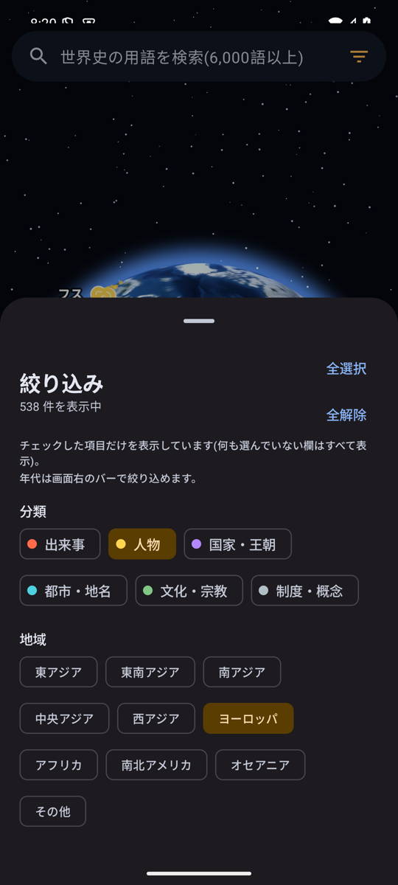
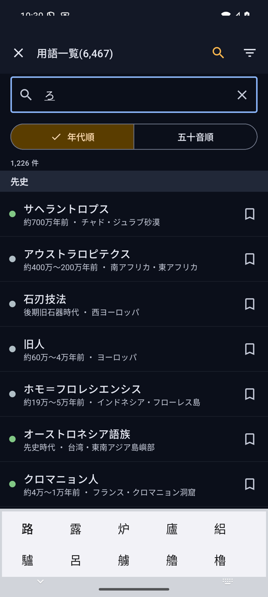

# 地球儀で見る世界史wikipedia

リアルな 3D 地球儀の上に、世界史の主要な用語(約 6,500 語)を、
出来事・人物・国家などにゆかりのある座標へピンとして配置し、
タップすると **Wikipedia** の記事と、関連する **YouTube** 動画の検索結果を
アプリ内で開ける Android アプリです。地図画像は NASA Blue Marble を同梱し、オフラインでも地球儀が動きます。

## スクリーンショット

| 地球儀の全体表示 | 拡大と大気の表現 | 用語の詳細カード | 分類・地域の絞り込み | 用語一覧(時代順) | 一覧内の検索 |
|:---:|:---:|:---:|:---:|:---:|:---:|
|  |  |  |  |  |  |

ドラッグで回転、ピンチやダブルタップで拡大し、ピンをタップすると分類・年代・場所と Wikipedia 由来の一行解説が出ます。「Wikipedia」で記事を、「動画」でその用語の YouTube 検索結果を、いずれもアプリ内で開けます。

## 特徴

### 地球儀
- OpenGL ES による自前の地球儀レンダラ。NASA Blue Marble を 5 段階のタイル(level 0〜4、約 42MB)で同梱し、オフラインで動作。より高倍率まで拡大できます。
- ドラッグ回転・慣性・ピンチズーム・ダブルタップ拡大(「指の下の地点を保つ」操作)。
- 6,000 語以上のピンを画面上で自動間引き・ラベル配置。ズームすると同じ場所の項目を円状に展開します。
- 大気のグロー・星空・球の陰影で立体的に表示。

### 用語を探す
- **検索**: 用語名・別名・地名・Wikipedia 題名で検索。表記ゆれ(全半角、ひらがな/カタカナ、「ヴ/バ」表記)に対応。
- **年代の絞り込み**: 画面右下の縦バーで年代範囲を指定。ハンドルのドラッグに加え、数値入力(紀元前を含む)にも対応。全 6,467 語がいずれかの時代に分類され、たとえば 20 世紀に絞ると同期間の用語がすべて表示されます。
- **分類・地域の絞り込み**: 絞り込みを開くとチップはすべて未選択で、見たい分類・地域だけをチェックして表示します。「全選択」「全解除」で一括操作。片方の欄が未選択ならその欄では絞りません(例: 「人物」だけなら全地域の人物)。何も選ばずに閉じることはできず、「何も選択されていません」と案内します。
- ランダム表示、地球全体へ戻る操作。

### 用語一覧
- 全用語の一覧を **時代順 / 五十音順**で表示。五十音順は Wikipedia の記事冒頭から取得した読みで並べ、漢字始まりの用語も正しいカナ行に分類されます。
- 一覧の中を**検索**、**分類・地域で絞り込み**(地球儀と同じく、チェックした分類・地域だけを表示。全選択・全解除あり)。
- 一度でも開いた用語には**既読マーク**、**ブックマーク**(最大 1,000 件)。ブックマークも同じ一覧 UI で表示・並べ替え・絞り込みできます。

### 詳細・記事
- 詳細カードから Wikipedia(モバイル版)の記事と、用語名で検索した YouTube の結果をアプリ内 WebView で表示。共有も可能。

## データ
- 用語の解説・座標・年代・分類・読みは **Wikipedia / Wikidata** の情報から生成しています(用語の見出し語以外の内容を Wikipedia 由来に統一)。
- 地球画像は **NASA Blue Marble: Next Generation**(パブリックドメイン)です。アプリアイコンも同画像から生成しています。
- 詳細は `NOTICE.md` を参照してください。

## プライバシー
- 個人情報を収集・送信しません。既読・ブックマークは端末内にのみ保存されます。
- 詳細は `docs/PRIVACY.md` を参照してください。

## ビルド
```bash
./gradlew assembleDebug      # デバッグ APK
./gradlew bundleRelease      # 署名済み AAB(keystore.properties が必要)
```
`local.properties` に `sdk.dir` を設定してください(compileSdk 36 / minSdk 30)。
リリース手順は `docs/RELEASE.md` を参照してください。

## データ生成
`tools/` に用語一覧の取得・Wikipedia 記事の対応付け・読みの取得・年代の推定・タイル生成・アイコン生成のスクリプトがあります。
`docs/DATA.md` を参照してください。

## ライセンス
- アプリ本体: MIT License(`LICENSE`)
- 同梱データ・画像の出典と条件: `NOTICE.md`
