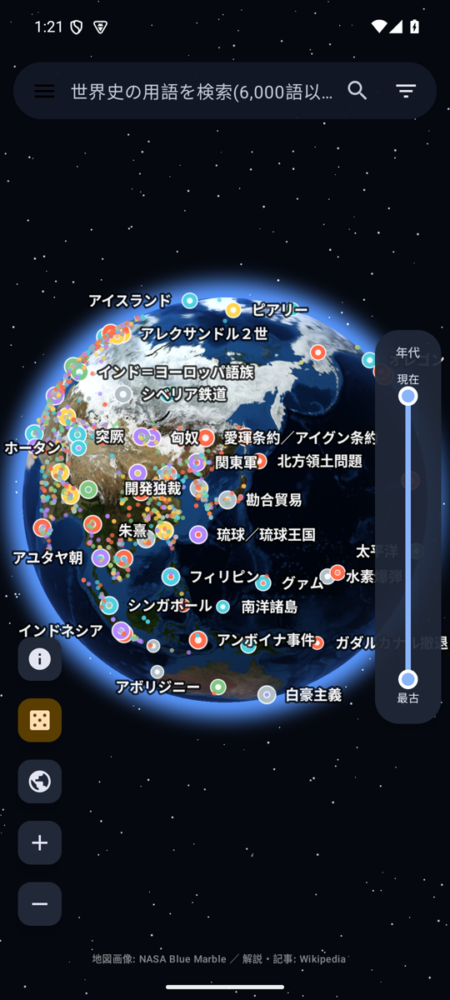
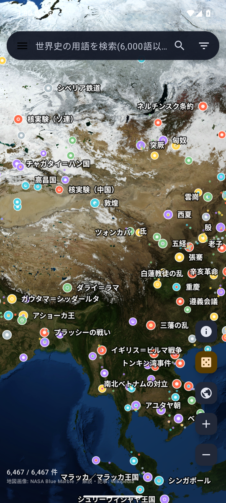
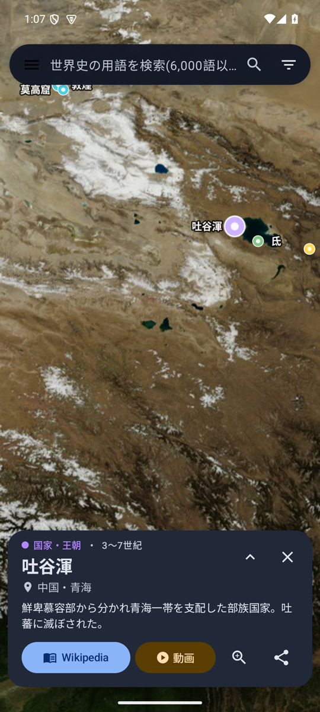
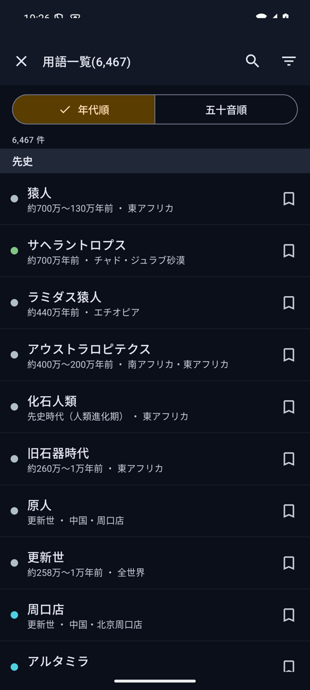

# 地球儀で見る世界史wikipedia

Google Earth 風の 3D 地球儀の上に、世界史の主要な用語(約 6,500 語)を
出来事・人物・国家などにゆかりのある座標へピンとして配置し、
タップすると **Wikipedia** の記事と、関連する **YouTube** 動画の検索結果を
アプリ内で開ける Android アプリです。

## スクリーンショット

| 地球儀の全体表示 | 東アジアを拡大 | 用語の詳細カード | 用語一覧(時代順) |
|:---:|:---:|:---:|:---:|
|  |  |  |  |

ドラッグで回転、ピンチやダブルタップで拡大し、ピンをタップすると分類・年代・場所と Wikipedia 由来の一行解説が出ます。「Wikipedia」で記事を、「動画」でその用語の YouTube 検索結果を、いずれもアプリ内で開けます。

## 特徴
- OpenGL ES による自前の地球儀レンダラ(NASA Blue Marble を 4 段階のタイルで同梱、オフラインで動作)
- ドラッグ回転・慣性・ピンチズーム・ダブルタップ拡大(Google Earth 風の「指の下の地点を保つ」操作)
- 6,000 語以上のピンを画面上で自動間引き・ラベル配置。ズームすると同じ場所の項目を円状に展開
- 用語検索(表記ゆれ・別名・地名・「ヴ/バ」表記に対応)、画面右端の縦バーによる年代の絞り込み、分類・地域による絞り込み、時代順/五十音順の一覧
- 詳細カードから Wikipedia(モバイル版)の記事と YouTube 検索をアプリ内 WebView で表示

## データ
- 用語の解説・座標・年代・分類は **Wikipedia / Wikidata** の情報から生成しています。
- 地球画像は **NASA Blue Marble: Next Generation**(パブリックドメイン)です。
- 詳細は `NOTICE.md` を参照してください。

## ビルド
```bash
./gradlew assembleDebug
```
`local.properties` に `sdk.dir` を設定してください(compileSdk 36 / minSdk 30)。

## データ生成
`tools/` に用語一覧の取得・Wikipedia 記事の対応付け・タイル生成のスクリプトがあります。
`docs/DATA.md` を参照してください。

## ライセンス
- アプリ本体: MIT License(`LICENSE`)
- 同梱データ・画像の出典と条件: `NOTICE.md`
